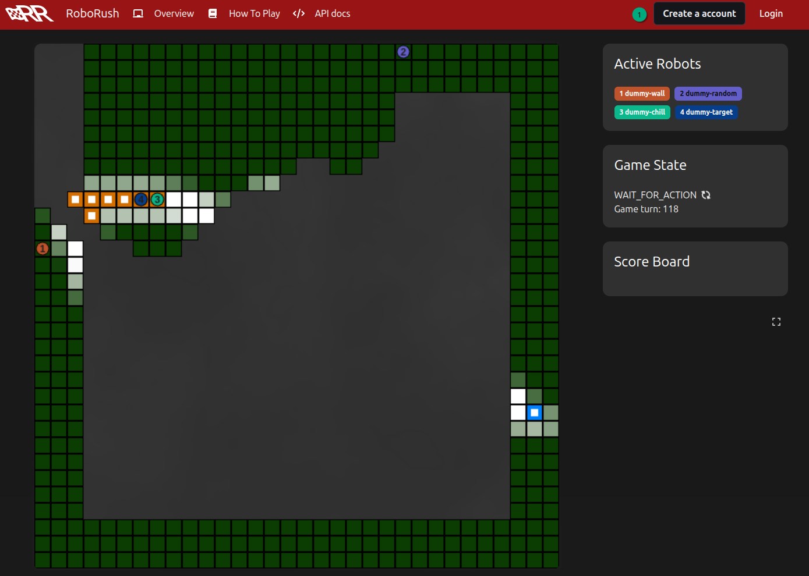
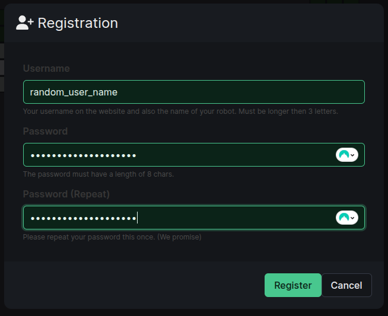
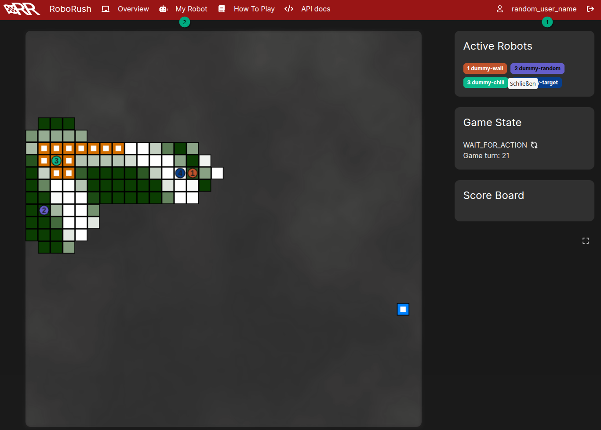
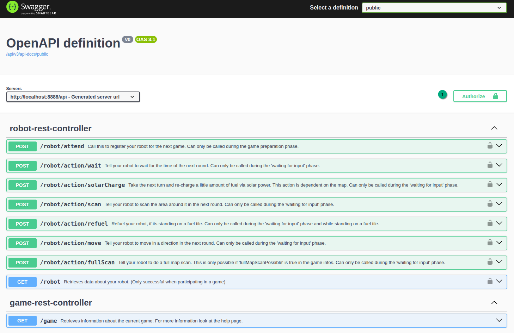
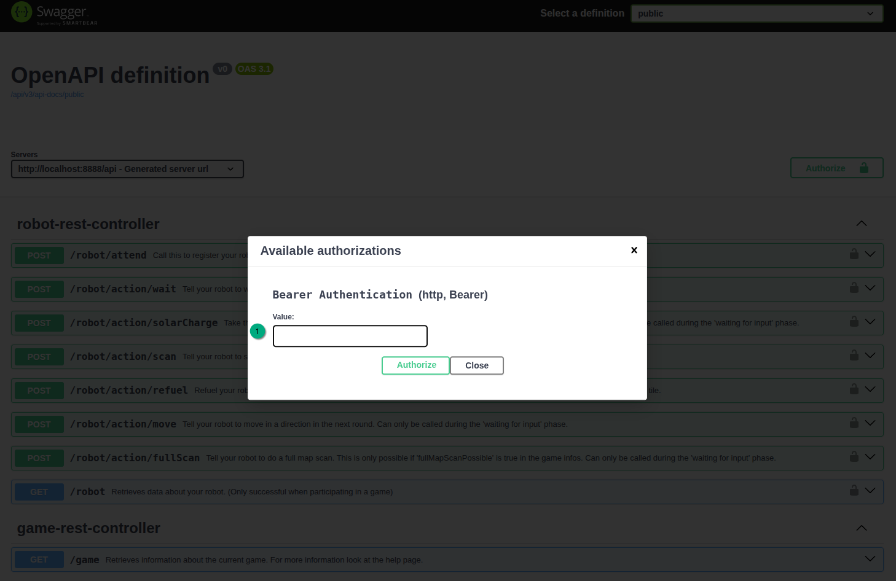
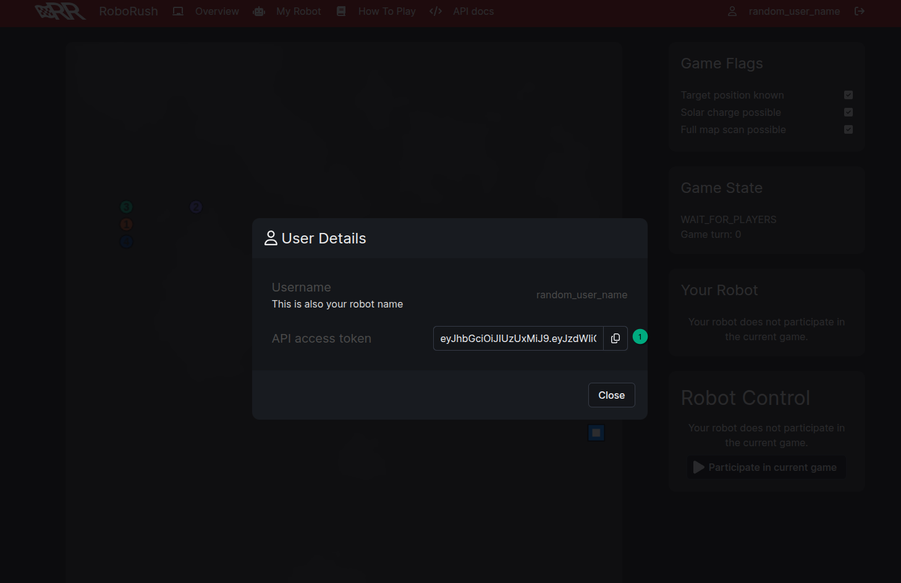

# How to run your local testing server

## Limitations

The local testing environment has been run on Windows / WSL and native Linux.

Your experience with macOS may vary.

## Prerequisites

- Docker up and running

## Get the local instance running

1. Depending on your OS, you need to (un)comment two lines in `config/traefik.yaml`
   - (Windows) Uncomment lines 25 and 36, and comment lines 24 and 35
   - (WSL and Native Linux) Uncomment lines 24 and 35, and comment lines 25 and 36
2. Navigate to `local-testing`
3. Start the local instance
   - (Windows) Run `start_local_env.bat`
   - (WSL and Native Linux) Run `start_local_env.sh`
4. The application should now be available at `http://127.0.0.1:8888`

## Change properties

An admin account has automatically been added. The credentials are as follows:

### Changing values in the web interface

You can determine the username and password for the root account as follows:

1. Username
   - The default admin username is `root`.
2. Password
   1. Open `local-testing/docker-compose.yaml` in your favorite editor.
   2. The password can be found at the following path:
      ```yaml
      services:
        # ...
        backend:
          # ...
          environment:
            # ...
            INITIAL_ROOT_PASSWORD: <this is the password>
      ```

With these credentials, you can use the GUI to modify the game to your liking.

### Using environment variables

The following values are of use to speed up things in `local-testing/docker-compose.yaml`:

| Variable                 | Influence                                                                        | What you need to do here                                                                 |
|--------------------------|----------------------------------------------------------------------------------|------------------------------------------------------------------------------------------|
| TIMEOUT_WAIT_FOR_PLAYERS | Time between start of player registration cycle and lock in for the current game | You must register your player during this window!                                        |
| TIMEOUT_WAIT_FOR_ACTION  | Time after which the current rounds locked in actions are executed               | You must select an action during this window, otherwise your robot idles this round.     |
| TIMEOUT_GAME_END         | Time between victory popup and the next player registration cycle                | You may pad yourself on the back during this window (not limited to games that you won!) |

Set these values according to your hearts' desire. The faster you set them, the quicker your tests.

### Caveat

Keep in mind that you control your robot via a REST interface. Nyquist's theorem applies.

## API commands

Check out the [API](http://localhost:8888/api/swagger-ui/index.html)

## So, how do I do this?

1. First, you need a user. You can't play as root, because then everyone would be rooting for you, and that's unfair.
   1. Create an account by clicking the `Create a account` button (1).

      

   2. Pick a creative name and a password

      

   3. Once you clicked on `Register`, you can continue.

2. Now to login

   1. Press the `Login` button (1).

      

   2. Enter your credentials and press the `Login` button.

      

   3. You can now see your name at (1). Press (2) to switch to your robot view.

      

   4. When the time is right (in between games), press the `Participate in current game` button to register your robot for the current round.

      

3. Let's now check out how your robot works.

   The API page provides you with an overview of available commands.

   You need, however, to authorize before you can send commands to your robot.

   1. Press the `Authorize` button.

      

   2. In the popup, enter your Bearer Authentication (1).

      

      You can check out (and copy!) your Bearer Token as follows.

      1. In the main view, press your name (1).

         

      2. Press the `Copy` icon next to your API access token to grab it.

         

      3. Enter the Bearer Token in the API view and press the `Authorize` button.

         

      4. Close the dialog.

         

   3. Uncollapse one of the commands (1) and press the `Try it out` button.

      

   4. Press the `Execute` button.

      

      The command is immediately sent, but let's look at what we receive in return.

   5. At (1), we can see the cURL command that was executed. In the area below (2), you can see the servers' response. Press (3) to resend the command.

      

   6. At (1), you can see what response body and headers were received. You can use these to investigate and troubleshoot your work.

      

Now, go forth and playeth!
